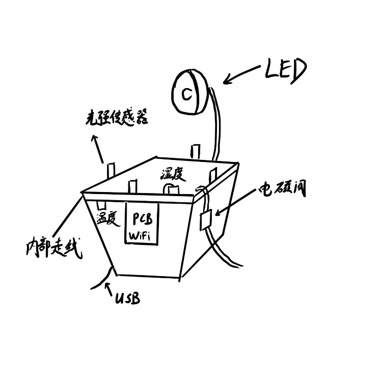
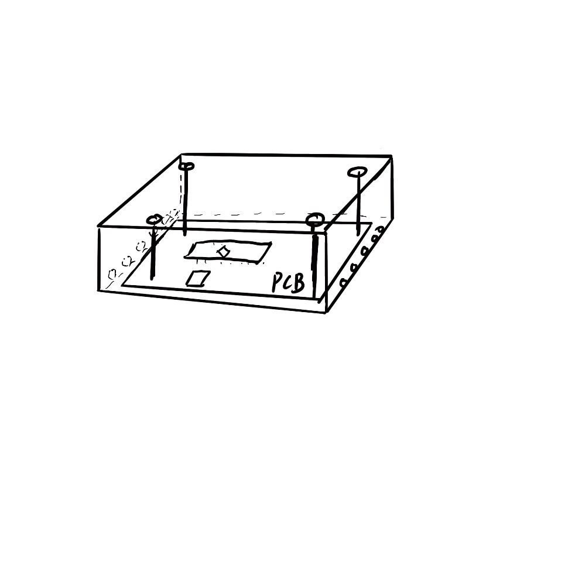
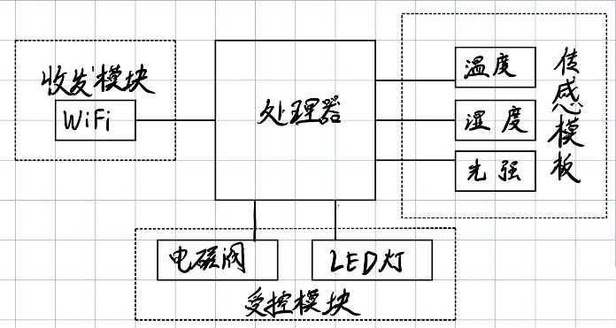
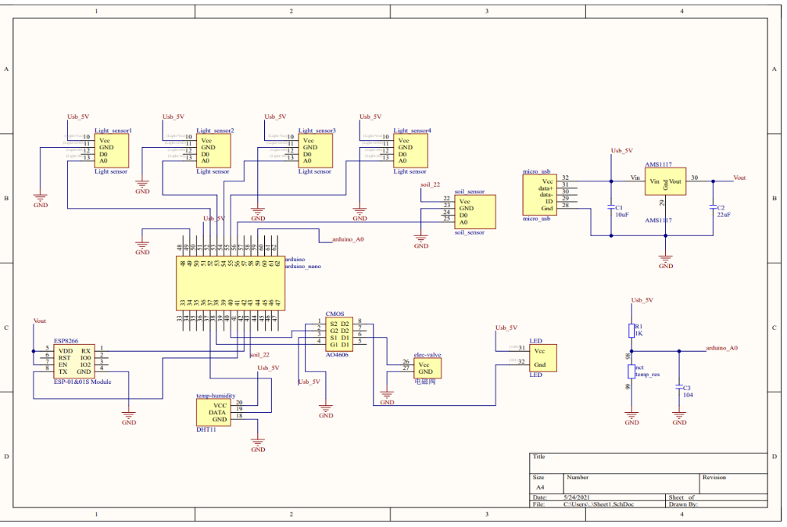
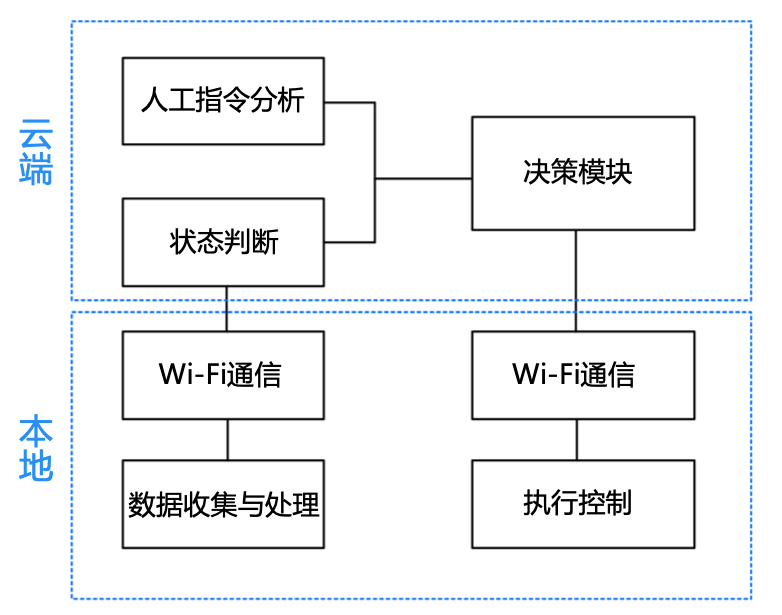

## 目录


- [智能花盆项目的README](#智能花盆项目的readme)
  - [项目描述](#项目描述)
    - [系统功能](#系统功能)
    - [主要技术](#主要技术)
  - [应用场景](#应用场景)
  - [设备硬件设计](#设备硬件设计)
    - [概念图](#概念图)
    - [PCB安装](#pcb安装)
    - [设备框图](#设备框图)
    - [电路图](#电路图)
  - [设备软件设计](#设备软件设计)
    - [软件框图](#软件框图)
  - [服务器搭建](#服务器搭建)
  - [前端网页设计](#前端网页设计)
  - [代码分析](#代码分析)
  - [维护者](#维护者)
  - [致谢](#致谢)
  - [如何贡献](#如何贡献)
# 智能花盆项目的README

## 项目描述

### 系统功能

+ 实时检测环境信息并显示
+ 自动浇水、自动补光
+ 人工远程控制
+ 历史信息的查看
+ 操作记录的查看
  
### 主要技术  

+ PCB板的设计(Altium Designer,江行健)
+ 硬件软件的编写(Arduino,李泓臻)
+ 通信协议的选择(mqtt和http,汪俊)
+ 服务器的搭建(Flask+sqlite,汪俊)
+ 网页的搭建(Bootstrap,汪俊)
  
项目网址为[http://www.pkuintelligenthardware.online](http://www.pkuintelligenthardware.online/)

目前开源在github上,网址为[https://github.com/WangJun2000/intelligentFlowerpot](https://github.com/WangJun2000/intelligentFlowerpot)


## 应用场景
日常使用：加班/上学/出差繁忙,无法及时对植物进行浇水与环境调整

科学研究：对植物生长环境进行实时监测并对数据进行收集与分析


## 设备硬件设计

### 概念图


如图为智能花盆的概念图。该智能花盆包含光强传感器、土壤湿度传感器与温度传感器，获取环境数据，利用温敏电阻辅助测温；通过电磁阀控制浇水，LED灯补充光照实现工作。同时为了避免潮湿环境对电路产生影响，花盆应当将导线藏于花盆内部。

### PCB安装



如图为PCB的包装，用长方体盒子将电路板包装，四角用螺丝固定。

### 设备框图

如图为智能花盆的设备框图，智能花盆分为处理器、传感模块、收发模块与
受控模块四个部分。传感模块读取外界环境信息，收发模块实现环境信息的发送与指令的接收，受控模块根据指令作出行为。

### 电路图

如图为智能花盆的具体电路图。

## 设备软件设计


### 软件框图


如图为软件流程图。各部分功能如下：

+ 数据收集与处理：收集传感器数据并进行简单处理
+ Wi-Fi通信：将数据打包上传云端
+ 状态判断：依据本地上传的数据对环境的状态进行判断
+ 人工指令分析：在网页接收、分析人工下达的指令
+ 决策模块：根据植株状态以及人工指令进行决策
+ 执行控制：在本地控制执行模块（硬件）执行相应决策


## 服务器搭建
netstat -tunpl |grep 80
sudo python3 myApp.py runserver -h 0.0.0.0 -p 80
sudo nohup python3 myApp.py runserver -h 0.0.0.0 -p 80 >out.log 2>&1 &
## 前端网页设计

## 代码分析
```
|-- README.md                                     //帮助文档
|-- myApp.py                               //主函数所在的文件
|-- out.log                         //服务器后台运行的输出日志
|-- migrations                               //数据库迁移模块
|   |-- ...
|-- mqtt                                      //mqtt测试模块
|   |-- ... 
|-- myApp                                    //flask功能模块
|   |-- __init__.py      //create_app()所在文件,可以初始化app
|   |-- createDB.py                        //数据库初始化模块
|   |-- myApp.db                                    //数据库
|   |-- settings.py                               //配置文件
|   |-- exts                                      //扩展模块
|-- |   |   |-- __init__.py//初始化SQLAlche、Bootstrap、Mqtt
|   |-- static                                    //静态文件
|   |   |-- css
|   |   |   |-- style.css               //首页四叶草的css文件
|   |   |-- images                            //静态图片资源
|   |   |   |-- ...
|   |   |-- js                                       //js库
|   |       |-- ...
|   |-- templates
|   |   |-- base.html                         //基础html模板
|   |   |-- bindFlowerpot.html                //绑定花盆界面
|   |   |-- flowerpot.html         //用户有花盆登录后的主界面
|   |   |-- flowerpotControlHistory.html  //花盆操作记录界面
|   |   |-- flowerpotHistory.html         //花盆历史信息界面
|   |   |-- history.html             //虚构历史作为测试的界面
|   |   |-- index.html                               //首页
|   |   |-- login.html                           //登录界面
|   |   |-- registerFlowerpot.html    //管理员注册花盆的界面
|   |   |-- show.html          //用户登录后没有花盆返回的界面
|   |   |-- signup.html                         //注册界面
|   |-- user
|       |-- __init__.py              
|       |-- models.py                     //数据库的数据模型
|       |-- mqttCallback.py                //mqtt的回调函数
|       |-- veiw.py             //falsk蓝图,用来实现路由模块
|-- screenshots                   //写README要用到的一些图片
|   |-- ...
|-- tests                                        //测试模块
    |-- ...
```


## 维护者
**汪俊**:
+ email:2595676015@qq.com


## 致谢
感谢**段晓辉**老师和**智能电子系统设计课程组**对本项目的大力支持

## 如何贡献
请到[issues](https://github.com/WangJun2000/intelligentFlowerpot/issues)提出贡献

